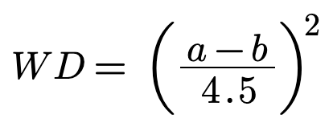

# WATCHMATCH frontend

Created as a final project for Flatiron School Software Engineering bootcamp, and continuing to be worked on and improved, to continue learning.

WATCHMATCH is a webapp which matches users based on how they rate movies. Users can rate movies on a scale from 1/2 star to 5 stars. The ratings of all movies any two users have both rated are compared to each other on a weighted algorithmic scale and then averaged to find a maximum possible compatibility percentage of the users' tastes. In addition, the percentage is adjusted by a margin of error based on how many rated movies the users have in common. This method was inspired by the algorithm used on OKCupid. ([Inside OKCupid: The math of online dating](https://www.ted.com/talks/christian_rudder_inside_okcupid_the_math_of_online_dating/transcript?language=en))

The weighted difference for any two users' ratings of the same movie are calculated as follows:

where a and b are two users' ratings of the same movie (4.5 is the greatest possible difference between two ratings.)

For more information on the backend, please see [watchmatch-backend](https://github.com/jasonchilcott/watchmatch-backend)

WATCHMATCH is currently live at https://watchmatch.herokuapp.com/

## Technologies Used

- React.js - The frontend of WATCHMATCH was written in React.js. This currently also includes the calculations of the matching system.
- [TMDb API](https://developers.themoviedb.org/3) - External API used for movie information and poster images, as well as searches by keyword, genre, and lists from users on their extensive website. Movies are queried by the frontend, then sent to the backend to add any movies in the query not yet added to the database.
- [react-router-dom](https://www.npmjs.com/package/react-router-dom) - Used for all the routing and links.
- [react-rating-stars-component](https://www.npmjs.com/package/react-rating-stars-component) - Used for responsive, customizable ratings display and user input.
- [React Icons](https://www.npmjs.com/package/react-icons) - Social media icons on the user profile pages.
- [Bootstrap](https://getbootstrap.com) - Used to style buttons and forms.

## Issues & Solutions

...